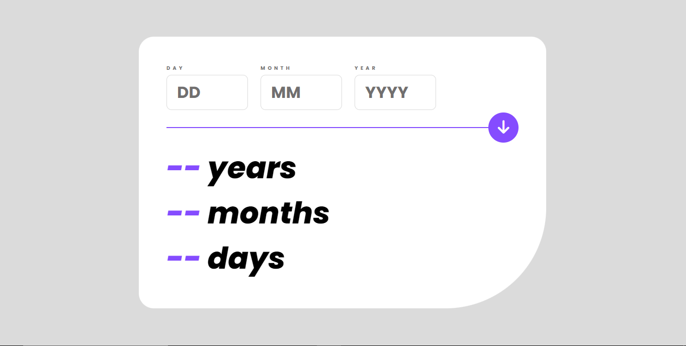

# Frontend Mentor - Age calculator app solution

This is a solution to the [Age calculator app challenge on Frontend Mentor](https://www.frontendmentor.io/challenges/age-calculator-app-dF9DFFpj-Q). Frontend Mentor challenges help you improve your coding skills by building realistic projects. 

## Table of contents

- [Overview](#overview)
  - [The challenge](#the-challenge)
  - [Screenshot](#screenshot)
  - [Links](#links)
- [My process](#my-process)
  - [Built with](#built-with)
  - [Continued development](#continued-development)
  - [Useful resources](#useful-resources)
- [Author](#author)

## Overview

### The challenge

Users should be able to:

- View an age in years, months, and days after submitting a valid date through the form
- Receive validation errors if:
  - Any field is empty when the form is submitted
  - The day number is not between 1-31
  - The month number is not between 1-12
  - The year is in the future
  - The date is invalid e.g. 31/04/1991 (there are 30 days in April)
- View the optimal layout for the interface depending on their device's screen size
- See hover and focus states for all interactive elements on the page
- **Bonus**: See the age numbers animate to their final number when the form is submitted

### Screenshot

### Links

- Solution URL: [GitHub](https://github.com/ThatGuyChike/age-calculator)
- Live Site URL: [Vercel]([https://your-live-site-url.com](https://age-calculator-theta-orpin.vercel.app/))

## My Process

### Built with

- Semantic HTML5 markup
- CSS custom properties
- Flexbox
- CSS Grid
- Mobile-first workflow
- [React](https://reactjs.org/) - JS library

### Continued development

This project piqued my interest in writing more custom hooks. They'd have cleaned up a host of all the useEffects I had to write.

### Useful resources

- [The 'before' pseudo-elelment](https://developer.mozilla.org/en-US/docs/Web/CSS/::before) - Was useful in helping me create the divider effect between the inputs and the displayed age.
- [The 'after' pseudo-element](https://developer.mozilla.org/en-US/docs/Web/CSS/::after) - Same as the 'before' pseudo-element.
- [How to build an animated counter in React](https://plainenglish.io/blog/attempting-to-build-a-cool-animated-counter-with-react-and-css-e37f7f2d47e4) - Helped me in putting together the code that handled the counting animation.

## Author

- Frontend Mentor - [@ThatGuyChike](https://www.frontendmentor.io/profile/ThatGuyChike)
- Twitter - [@ThatGuyChike](https://www.twitter.com/ThatGuyChike)
